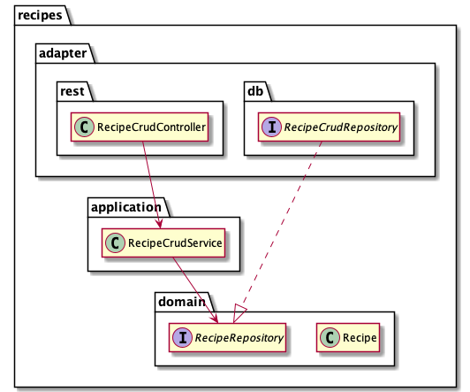

# RECIPES-MANAGER
`recipes-manager` is a CRUD REST API that allow users to manage their favourite recipes.

# Architecture & General design
The `recipes-manager` implementation (within `src/main/java/my.jmangeruga.recipes`) follows a light implementation of
the Hexagonal architecture.

I've taken the election of Hexagonal over a conventional layered arch under the assumption that, event though currently 
the project is totally simple, it could evolve into something bigger and richer and Hexagonal is more versatile. Thus, I 
preferred to provide strong foundations from the beginning. 

**Notes on architecture election**
- Considering that for now it's just a CRUD, I tried to keep things as simple as possible in spite of the architectural election: 
  - Allowing the presentation layer (rest in our case) to use, without translation, the models
  from application layer. 
  - Domain entities being implemented with the JPA entities is OK here.
  - Features of Spring (mostly annotations) are allowed within the business layer (application + domain).

  Other implementation details might be described within the code when it applies.

- It would be reasonable to argue that we could start from a layered architecture and migrate it whenever we discover that our CRUD service is starting to evolve.
However, the conceptual benefits (loose coupling, focus on domain, testability) of Hexagonal worth it.

- In the case that we know in advance we would be implementing a forever-CRUD application, a layered architecture would work perfectly.


## Class diagram
  
In the above diagram are showed the principal components that build the solution.
- `RecipeCrudController` that exposes the application features as a REST API.
- `RecipeCrudService` which is the business entry point
- `RecipeRepository` modeling the storage of Recipes
- `Recipe` is the principal domain class representing a recipe in our context.
- `RecipeCrudRepository` which is the concrete implementation of the repository. In this case, a spring interface repository was enough.

Other classes not relevant for the architectural purpose were left out of this diagram.

**Notes on design**  
Among others that might not be documented, check:  
[Recipe comments](src/main/java/my/jmangeruga/recipes/domain/Recipe.java)  
[RecipeCrudService#findAll() comments](src/main/java/my/jmangeruga/recipes/application/RecipeCrudService.java)

## REST API
Follow the [usage description](docs/api-usage.md) to see more details.

Besides the API usage, there were some decisions that worth mentioning here.

To allow future growth of the current API, the retrieval of items was wrapped inside a json object. That way, we might add other stuff in the future along the recipes items.

To represent if a recipe is vegetarian or not, I chose to add labels to the presentation of the recipe. That way, we could continue adding characteristics from other type there without polluting a lot the rest of the payload.

## Authentication & Security
Given that `recipes-manager` is a REST API, probably living within a microservice environment, a stateless mechanism of authentication is what made more sense to me.

As the only thing that we needed was some mechanism to prove the authenticity of a request, using simple token authentication seemed enough. There are other alternatives, like using a JWT, which we could explore later.

The current design assumes there exists some remote service able to answer, given a token, if it corresponds to a valid authenticated user or not.

**Notes on selected approach**
- The communication with that remote service was mimicked and the dummy service uses a set of predefined tokens (configured by properties).
- The tokens are plain string for this assessment.

**Other comments**
- Communication with mysql database 

## Used technologies
- Java11
- Spring boot & Spring security
- MySQL
- FlywayDB
- Docker
- Maven

### Implementation
`spring-security` was selected given its convenient defaults to protect against common security risks. Also, it allows a relatively simple customization as done in this case for implementing token authentication. 

# Installation

## Prerequisites
- Java 11
- Docker

## Build
Just execute 
```
./mvnw clean install
``` 
to compile, test and finally build a local docker image of the project.

## Run
There is provided a convenient docker compose file to spin up the environment.

```
docker-compose -f docker/docker-compose.yml up
```

Within that same compose file, there is a predefined dummy static credential which will be used in this environment. 

## Local development
If you'd like to run the java application from your favourite IDE, the needed database may be started from the docker compose files to work with.

```
docker-compose -f docker/docker-compose.yml -f docker/docker-compose.dev.yml up db
```

The needed defaults are available by using the `dev` profile. To enable the profile, just add the argument `--spring.profiles.active=dev` when running the application  

# Test scenario descriptions

Check [test scenarios](docs/test-scenarios.md)
